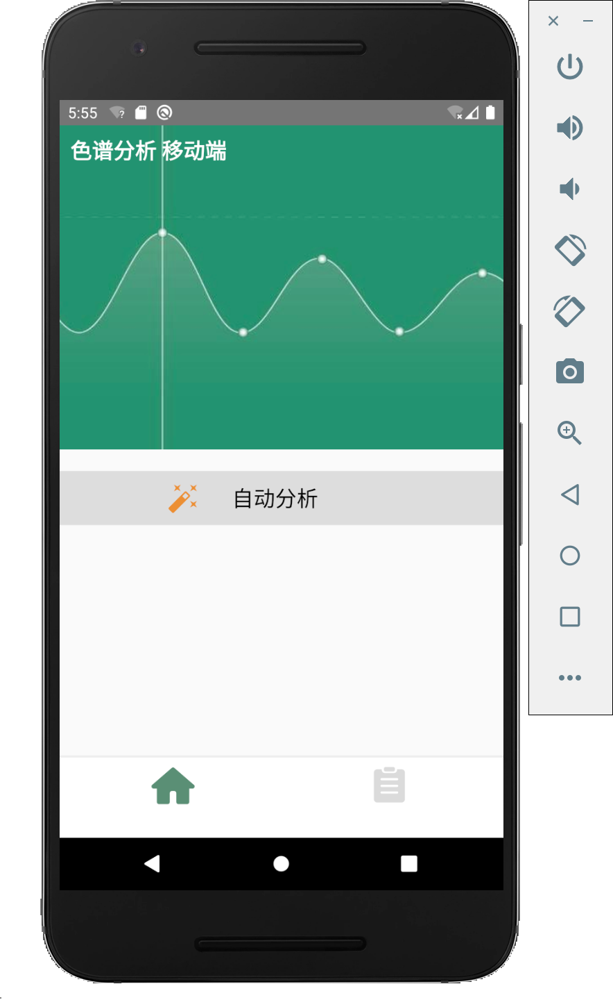
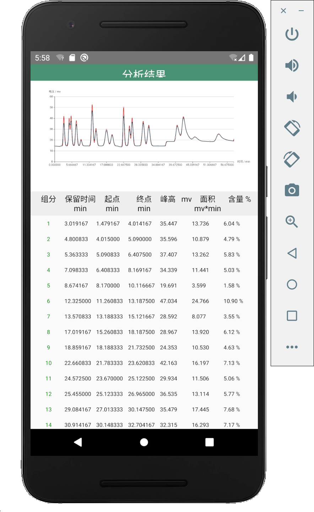

# 基于 React Native 的色谱分析软件 (东南大学仪科学院毕设项目)

web 版连接：[React web 色谱分析软件](https://github.com/qumuchegi/web-chromatography-analysis)

React Native 版的色谱分析软件依赖于 web 版提供的服务端色谱算法 API

## 软件界面

1. 首页：

2. 上传色谱原始数据文件和设置色谱算法参数：

3. 色谱分析结果：

